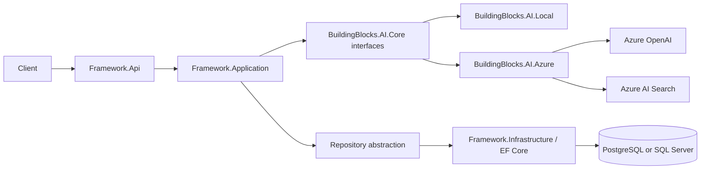

# Framework

Reusable .NET 9 foundations for layered APIs and document-based AI applications. Framework combines generic CRUD and persistence abstractions with a working flow for ingesting text, retrieving relevant evidence, and answering questions with citations.

This is a reference implementation and a starting point for consuming applications. Business entities, business rules, specialized document profiles, and application-specific authorization belong in those applications.

## Contents

- [Capabilities and current status](#capabilities-and-current-status)
- [Architecture](#architecture)
- [Getting started](#getting-started)
- [Try the document workflow](#try-the-document-workflow)
- [API reference](#api-reference)
- [Configuration](#configuration)
- [Authentication and tenant isolation](#authentication-and-tenant-isolation)
- [Extending Framework](#extending-framework)
- [Testing](#testing)
- [Docker and Azure deployment](#docker-and-azure-deployment)
- [Troubleshooting](#troubleshooting)
- [Roadmap](#roadmap)

## Capabilities and current status

| Area | Included today |
| --- | --- |
| Web API | ASP.NET Core controllers, request validation, Problem Details errors, Development Swagger UI, health endpoints |
| Application foundation | Generic services, repositories, AutoMapper mappings, CRUD controller bases, pagination and sorting |
| Persistence | EF Core configuration for PostgreSQL and SQL Server; entities and migrations are supplied by consuming applications |
| AI contracts | Provider-neutral interfaces for chunking, indexing, retrieval, generation, and document profiles |
| Local AI | In-memory keyword retrieval and deterministic extraction of source text; no cloud account or language model needed |
| Azure AI | Azure OpenAI embeddings and chat, Azure AI Search hybrid retrieval, and Azure identity authentication |
| Access boundaries | Tenant and optional scope filtering for knowledge requests; JWT authentication outside Development |
| Infrastructure | Dockerfile and alternative Azure Bicep and Terraform definitions |
| Tests | Unit, architecture, and API integration tests |

The local provider loses indexed documents when the process stops. Azure stores indexed chunks in Azure AI Search, but persistent document metadata, ingestion jobs, retries, and deletion workflows are not implemented. Ingestion accepts text in JSON; file upload, OCR, AWS adapters, and MCP tools are not implemented.

## Architecture

The solution contains eight source projects and three test projects:

```text
Framework.sln
src/
  Framework.Api/             HTTP endpoints, authentication, errors, composition
  Framework.Application/     Use cases, service and persistence abstractions
  Framework.Domain/          Entity interfaces and domain exceptions
  Framework.Contracts/       Request/response DTOs and pagination models
  Framework.Infrastructure/  EF Core repositories and provider registration
  BuildingBlocks.AI.Core/    Independent AI interfaces and models
  BuildingBlocks.AI.Local/   In-memory retrieval and extractive answers
  BuildingBlocks.AI.Azure/   Azure OpenAI and Azure AI Search adapters
tests/
  Framework.UnitTests/
  Framework.ArchitectureTests/
  Framework.IntegrationTests/
infrastructure/
  bicep/                    Azure Bicep deployment definitions
  terraform/                Alternative Terraform deployment definitions
  search-index.json         Azure AI Search index schema
  create-search-index.ps1    Index bootstrap script
```

This diagram shows runtime calls through the registered interfaces:



`BuildingBlocks.AI.Core` has no Framework, ASP.NET Core, persistence, or cloud SDK dependency. Local references Core only. Azure references Core and keeps provider details behind those interfaces. Application does not reference Infrastructure or API; the API wires implementations together through `AddApplication()` and `AddInfrastructure()`.

Package versions are centralized in [Directory.Packages.props](Directory.Packages.props). Shared compiler settings live in [Directory.Build.props](Directory.Build.props).

## Getting started

### Prerequisites

- .NET 9 SDK; check installed SDKs with `dotnet --list-sdks`.
- An editor or IDE supporting the solution's `net9.0` target.
- PostgreSQL or SQL Server for database-backed features and database readiness checks.
- Docker only if you want to build or run a container.

The local ingestion and answer endpoints use an in-memory knowledge store and can be tried without a running database. Database health endpoints report failure until a configured database is reachable.

### Build and run

From the repository root:

```powershell
dotnet restore Framework.sln
dotnet build Framework.sln --no-restore
dotnet test Framework.sln --no-build
dotnet run --project src/Framework.Api/Framework.Api.csproj --launch-profile http
```

Open `http://localhost:5280/swagger`. The `http` launch profile selects Development and the default Local AI provider. Stop the API with Ctrl+C.

In Visual Studio, open `Framework.sln`, set **Framework.Api** as the startup project, and select the `http` or `https` launch profile. Selecting an AI class library as the startup project will not start the API.

For local HTTPS:

```powershell
dotnet dev-certs https --trust
dotnet run --project src/Framework.Api/Framework.Api.csproj --launch-profile https
```

The HTTPS profile uses `https://localhost:7052/swagger`.

## Try the document workflow

Keep the API running with the `http` profile. Run these commands in a second PowerShell terminal.

### 1. Discover profiles

```powershell
$baseUrl = 'http://localhost:5280'
Invoke-RestMethod "$baseUrl/api/v1/ai/document-profiles"
```

The built-in `general-document` profile allows ingestion and question answering. Its language list is `*` and it does not require human review. Specialized profiles are supplied by consuming applications.

### 2. Ingest a document

```powershell
$tenantId = '11111111-1111-1111-1111-111111111111'
$documentBody = @{
    title = 'Operations Manual'
    content = 'Backup credentials must be rotated every thirty days.'
    profile = 'general-document'
    tenantId = $tenantId
    scopeId = $null
    language = 'en'
    sourceUri = 'https://example.test/operations-manual'
} | ConvertTo-Json

$document = Invoke-RestMethod -Method Post `
    -Uri "$baseUrl/api/v1/knowledge/documents" `
    -ContentType 'application/json' -Body $documentBody
$document.data
```

A successful request returns HTTP 201 with a generated `documentId`, `status: "ready"`, `chunkCount`, and `profile` inside `data`. The service splits and indexes content synchronously. `sourceUri` is citation metadata; the API does not download that URL.

### 3. Ask a question

```powershell
$questionBody = @{
    question = 'How often are backup credentials rotated?'
    profile = 'general-document'
    tenantId = $tenantId
    documentIds = @($document.data.documentId)
    maxResults = 5
} | ConvertTo-Json

$answer = Invoke-RestMethod -Method Post `
    -Uri "$baseUrl/api/v1/ai/answers" `
    -ContentType 'application/json' -Body $questionBody
$answer.data | ConvertTo-Json -Depth 6
```

Local returns source passages with `provider: "local-extractive"`, `grounded: true`, and citations containing document IDs, titles, excerpts, source URIs, and chunk numbers. It extracts evidence rather than generating a natural-language synthesis.

Omit `documentIds` to search all visible documents for that tenant, scope, and profile. If retrieval returns no evidence, the API returns HTTP 200 with `grounded: false`, `provider: "none"`, no citations, and an explanation that sufficient evidence was unavailable.

`grounded: true` currently means evidence was retrieved and passed to the model. It is not an independent verification of every generated statement; citations are built from retrieved chunks.

## API reference

| Method | Path | Purpose |
| --- | --- | --- |
| GET | `/api/v1/ai/document-profiles` | List document profiles |
| POST | `/api/v1/knowledge/documents` | Ingest and index text |
| POST | `/api/v1/ai/answers` | Retrieve evidence and answer a question |
| GET | `/api/v1/health` | Structured health response, including database status |
| GET | `/health/live` | Process liveness without a database check |
| GET | `/health/ready` | Database connectivity check |
| GET | `/health` | All registered health checks |

Successful controller responses use `CommonResult<T>`:

```json
{
  "succeeded": true,
  "data": {},
  "error": null
}
```

Request validation and handled exceptions use ASP.NET Core Problem Details. Unknown profiles, empty tenant GUIDs, and invalid inputs produce HTTP 400. Authentication and authorization failures outside Development produce HTTP 401 or 403. Unhealthy database checks produce HTTP 503. The `/health` middleware endpoints use their own health response format.

Ingestion requires a title of at most 300 characters, content of at least 20 characters, a profile, and a nonempty tenant GUID. Language defaults to `en`. Questions must contain 2-2,000 characters; `maxResults` defaults to 5 and accepts 1-20. See the [AI DTOs](src/Framework.Contracts/AI) for complete request and response definitions.

Generic CRUD controllers are abstract extension points, with no concrete business-entity endpoints in this repository. Derived controllers can provide get-by-ID, `filtered-search`, create, update, and delete routes. Pagination defaults to page 1 and 20 items, with a maximum page size of 500.

## Configuration

The API uses ASP.NET Core configuration: `appsettings.json`, environment-specific settings, environment variables, and command-line arguments. Double underscores represent nested keys in environment variable names.

| Environment variable | Default or purpose |
| --- | --- |
| `ASPNETCORE_ENVIRONMENT` | Launch profiles set `Development`; required for Local AI |
| `AI__Provider` | `Local`; select `Azure` for the installed cloud adapter |
| `Database__Provider` | `PostgreSql`; also supports `SqlServer` |
| `ConnectionStrings__DefaultConnection` | Database connection string; Development settings target local PostgreSQL |
| `Database__CommandTimeoutInSeconds` | `30` |
| `Database__EnableSensitiveDataLogging` | `false` in base settings, `true` in Development |
| `Authentication__Authority` | JWT authority; required outside Development |
| `Authentication__Audience` | JWT audience; required outside Development |
| `AI__Azure__OpenAiEndpoint` | Azure OpenAI resource endpoint |
| `AI__Azure__ChatDeployment` | Chat model deployment name |
| `AI__Azure__EmbeddingDeployment` | Embedding model deployment name |
| `AI__Azure__SearchEndpoint` | Azure AI Search endpoint |
| `AI__Azure__SearchIndex` | Existing search index name |

Override database settings in the terminal that starts the API:

```powershell
$env:Database__Provider = 'PostgreSql'
$env:ConnectionStrings__DefaultConnection = 'Host=localhost;Port=5432;Database=framework;Username=postgres;Password=YOUR_LOCAL_PASSWORD'
dotnet run --project src/Framework.Api/Framework.Api.csproj --launch-profile http
```

The checked-in Development connection uses `postgres` as both username and password for local setup only. Supply real credentials through local environment variables or deployment secrets. `.env` and `appsettings.Local.json` are ignored by Git, but the application does not automatically load either file.

The EF Core context currently has no business tables or migrations. Configuring a database does not make document ingestion persistent; the AI index and EF Core database are separate components.

## Authentication and tenant isolation

Development permits unauthenticated knowledge requests for local exploration. Use that environment only for local development.

Outside Development, startup requires `Authentication:Authority` and `Authentication:Audience` and rejects Local AI. Application endpoints require a valid JWT. Health endpoints remain anonymous; Swagger is enabled only in Development.

Knowledge ingestion and question requests must match an application `tenant_id` GUID claim on the authenticated user. Requests containing `scopeId` must also match a `scope_id` GUID claim. The consuming application's identity system must issue these claims.

Retrieval applies these boundaries:

- Documents must belong to the requested tenant and profile.
- A query without a scope retrieves tenant-wide documents only.
- A scoped query can retrieve tenant-wide documents and documents in that exact scope.
- Optional document IDs further restrict results.

Azure applies tenant and scope filters before vector retrieval. New business-entity endpoints must implement their own authorization and tenant restrictions; generic repositories and CRUD bases do not add these automatically.

## Extending Framework

### AI components and providers

Reference `BuildingBlocks.AI.Core` for provider-neutral contracts. Add `BuildingBlocks.AI.Local` for deterministic development behavior or `BuildingBlocks.AI.Azure` for Azure integration. The host demonstrates registration in [DependencyInjection.cs](src/Framework.Infrastructure/DependencyInjection.cs).

| Interface | Responsibility |
| --- | --- |
| `ITextChunker` | Split text into indexable chunks |
| `IKnowledgeIndex` | Store document chunks and metadata |
| `IKnowledgeRetriever` | Retrieve chunks under tenant, scope, profile, and document filters |
| `IChatModel` | Produce an answer using supplied evidence |
| `IDocumentProfileCatalog` | Define and resolve profiles and allowed operations |

Implement new providers in separate adapter projects and register them in the host. Extend provider selection before configuring a new `AI:Provider` value; unsupported values fail at startup. Keep SDK types out of Core, Domain, Application, Contracts, and API.

### Application-specific features

1. Define entities, business rules, and DTOs in the consuming solution.
2. Implement services and mappings using the generic bases where appropriate.
3. Configure the consuming application's EF Core model, repositories, and provider-specific migrations. `FrameworkDbContext` is sealed and scans its own assembly for configurations, so external entities require explicit persistence integration.
4. Add concrete routed controllers and register their services.
5. Add authorization, tenant filters, validation, and tests for those features.

For specialized documents, register an `IDocumentProfileCatalog` implementation after `AddApplication()`. Profiles describe allowed operations, languages, and human-review requirements. Ingestion checks operations but does not enforce the declared language list. `RequiresHumanReview` adds an answer notice; it does not create an approval workflow or audit trail.

## Testing

```powershell
dotnet test Framework.sln
```

| Project | Coverage |
| --- | --- |
| `Framework.UnitTests` | Answer orchestration, pagination, Azure search filtering and response handling |
| `Framework.ArchitectureTests` | Layer and provider dependency boundaries |
| `Framework.IntegrationTests` | API ingestion and answers, health, tenant access, and authentication |

The integration fixture substitutes an EF Core in-memory database. The suite does not require a live database or Azure deployment and does not validate a real cloud deployment end to end.

## Docker and Azure deployment

Build from the repository root:

```powershell
docker build -t framework-api:local .
docker run --rm -p 5280:8080 -e ASPNETCORE_ENVIRONMENT=Development framework-api:local
```

This starts the Local AI demo in a container. The image uses a multi-stage .NET 9 build and a non-root runtime user. Database readiness fails unless you supply a reachable connection. Inside a container, `localhost` refers to that container; supply the database host through `ConnectionStrings__DefaultConnection`.

For Azure, choose Bicep or Terraform. The definitions cover a resource group, Container Apps, Container Registry, Azure OpenAI, Azure AI Search, and Azure SQL. Use one infrastructure tool to own a given resource set.

Deployment sequence:

1. Provision foundation resources with the selected tool.
2. Build and push the API container image.
3. Grant the bootstrap identity search permissions and create the index.
4. Configure database networking, secrets, JWT settings, and Azure AI settings.
5. Deploy the API and verify health and authenticated requests.

The Azure adapter uses `DefaultAzureCredential`, including managed identity in Azure. The supplied search schema uses 1,536-dimensional vectors; embedding output must match the schema.

Follow the detailed configuration and deployment instructions:

- [Infrastructure overview and deployment order](infrastructure/README.md)
- [Bicep instructions](infrastructure/bicep/README.md)
- [Terraform instructions](infrastructure/terraform/README.md)

## Troubleshooting

| Symptom | What to check |
| --- | --- |
| Visual Studio cannot start the selected project | Set `Framework.Api` as startup project; AI projects are class libraries |
| Startup requires JWT settings or rejects Local AI | Use the Development launch profile locally; deployed environments require JWT configuration and Azure AI |
| Liveness succeeds but readiness fails | Database availability, provider selection, connection string, and network access |
| A document disappears | Local AI stores documents in process memory; ingest again after restarting |
| An answer has no evidence | Tenant, scope, profile, document IDs, and matching words in indexed text |
| Azure requests fail | All five Azure settings, credentials, permissions, model deployments, and index schema |
| HTTPS certificate errors | Trust the development certificate or use the `http` profile |

## Roadmap

- Persist document metadata and ingestion jobs with provider-specific migrations.
- Add background ingestion, retries, deletion handling, and original-file storage.
- Add cloud extraction and OCR adapters for defined consuming use cases.
- Add prompt versioning, structured extraction, and document comparison.
- Add retrieval and answer evaluations, audit records, and human-review workflows.
- Validate production networking, operational monitoring, and cloud behavior end to end.

No license file is currently included. Choose and add a license before distributing this project under open-source terms.
